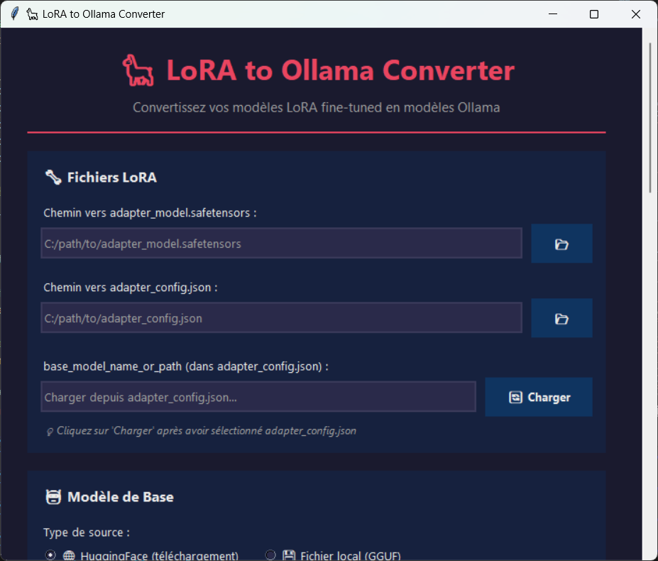
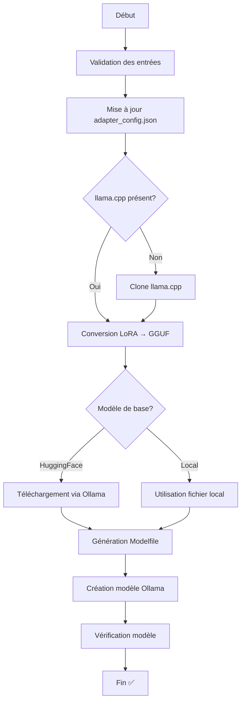
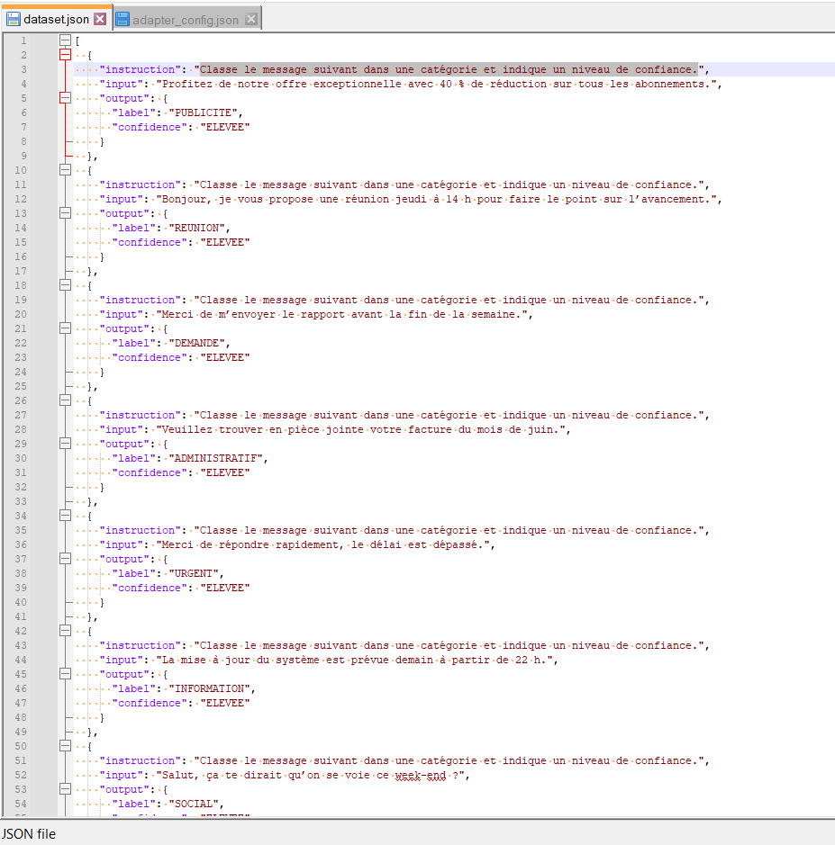
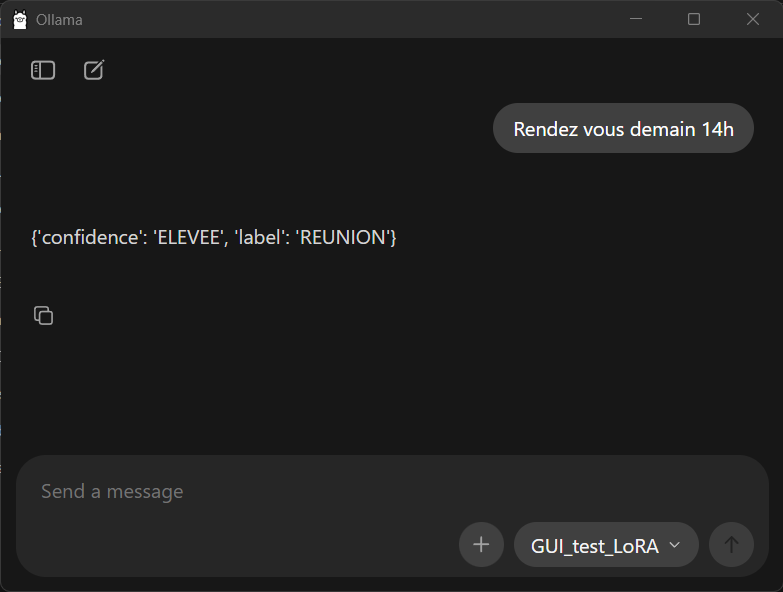
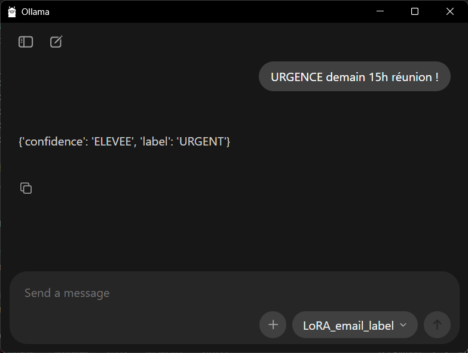

# LoRA to Ollama Converter

Application GUI permettant de convertir facilement vos modèles LoRA fine-tuned en modèles compatibles Ollama.


## Table des matières

- [Aperçu](#aperçu)
- [Fonctionnalités](#fonctionnalités)
- [Prérequis](#prérequis)
- [Installation](#installation)
- [Utilisation](#utilisation)
- [Workflow de conversion](#workflow-de-conversion)
- [Configuration avancée](#configuration-avancée)
- [Dépannage](#dépannage)
- [Exemple](#exemple)
- [Auteur](#auteur)

## Aperçu

**LoRA to Ollama Converter** est une application graphique intuitive qui automatise le processus de conversion d'un modèle LoRA (Low-Rank Adaptation) fine-tuné vers un format compatible avec Ollama. Elle gère automatiquement :

- La mise à jour de la configuration du modèle de base
- La conversion LoRA → GGUF via llama.cpp
- La création du Modelfile Ollama
- Le téléchargement automatique des modèles de base depuis HuggingFace
- L'enregistrement du modèle dans Ollama



## Fonctionnalités

### Gestion des fichiers LoRA
- Sélection intuitive des fichiers `adapter_model.safetensors` et `adapter_config.json`
- Chargement automatique du `base_model_name_or_path` depuis la configuration
- Modification facile du nom du modèle de base (ex: retirer `-bnb-4bit`)

### Sources de modèles de base flexibles
- **HuggingFace** : Téléchargement automatique depuis n'importe quel repo
  - Support des modèles privés/gated avec token HF
  - Gestion automatique du cache
- **Fichier local** : Utilisation d'un fichier GGUF déjà téléchargé

### Intégration llama.cpp
- Téléchargement automatique de llama.cpp si non présent
- Ou utilisation d'une installation existante
- Conversion automatique LoRA → GGUF

### Configuration Modelfile avancée
- **Templates prédéfinis** :
  - ChatML (Qwen, etc.)
  - Llama 3
  - Mistral/Mixtral
  - Alpaca
  - Vicuna
  - Custom (éditable)
- **Paramètres personnalisables** :
  - Temperature
  - Top P
  - Top K
  - Num Context
- **System prompt** optionnel
- **Stop tokens** automatiques selon le template

### Sortie et logs
- Nom personnalisable du modèle Ollama final
- Dossier de sortie configurable
- Logs détaillés en temps réel avec codes couleur
- Barre de progression

## Prérequis

### Logiciels requis

- **Python 3.8+** : [Télécharger Python](https://www.python.org/downloads/)
- **Git** : [Télécharger Git](https://git-scm.com/downloads)
- **Ollama** : [Installer Ollama](https://ollama.ai/download)

### Bibliothèques Python

L'application utilise uniquement des bibliothèques standard Python :
- `tkinter` 
- `json`
- `subprocess`
- `os`
- `threading`
- `pathlib`

## Installation

### 1. Cloner ou télécharger le projet

```bash
git clone https://github.com/IvannP39/LoRA_to_Ollama_converter.git
cd LoRA_to_Ollama_converter
```

Ou téléchargez simplement le fichier `Lora_to_Ollama.py`.

### 2. Installer les dépendances (en vrai il n'y en a pas donc ne le faite pas :) )

```bash
pip install -r requirements.txt
```

### 3. Vérifier Python

```bash
python --version
# ou
python3 --version
```

Assurez-vous d'avoir Python 3.8 ou supérieur.

### 4. Installer Ollama

Suivez les instructions sur [ollama.ai](https://ollama.ai/download) pour votre système d'exploitation.

Vérifiez l'installation :
```bash
ollama --version
```

## Utilisation

### Lancement de l'application

```bash
python Lora_to_Ollama.py
```

Ou sur certains systèmes :
```bash
python3 Lora_to_Ollama.py
```

### Guide pas à pas

#### 1. Fichiers LoRA

1. Cliquez sur **📂** à côté de "Chemin vers adapter_model.safetensors"
2. Sélectionnez votre fichier `adapter_model.safetensors`
3. Cliquez sur **📂** à côté de "Chemin vers adapter_config.json"
4. Sélectionnez votre fichier `adapter_config.json`
5. Cliquez sur **Charger** pour récupérer le `base_model_name_or_path`
6. **Important** : Modifiez le nom si nécessaire (ex: retirez `-bnb-4bit` ou `-GGUF`)

#### 2. Modèle de base

**Option A : HuggingFace**
1. Sélectionnez **HuggingFace**
2. Entrez le nom du repo (ex: `unsloth/llama-3-8b`)
3. Si le modèle est privé/gated, entrez votre token HF

**Option B : Fichier local**
1. Sélectionnez **Fichier local**
2. Cliquez sur **📂** et sélectionnez votre fichier `.gguf`

#### 3. llama.cpp

- **Laisser vide** pour un téléchargement automatique
- **Ou** spécifier le chemin vers une installation existante

#### 4. Configuration Modelfile

1. **Template** : Choisissez le template correspondant à votre modèle
   - ChatML pour Qwen, Yi, etc.
   - Llama 3 pour les modèles Llama 3.x
   - Mistral/Mixtral pour ces familles
   - Custom pour un template personnalisé

2. **System Prompt** (optionnel) : Définissez le comportement par défaut
   ```
   Tu es un assistant IA serviable et précis.
   ```

3. **Paramètres** (optionnels, valeurs par défaut si vides) :
   - **Temperature** : 0.7 (créativité)
   - **Top P** : 0.9 (diversité)
   - **Top K** : 40 (limitation des tokens)
   - **Num Ctx** : 4096 (taille du contexte)

#### 5. Sortie

1. **Nom du modèle** : Choisissez un nom pour votre modèle Ollama
   ```
   mon-modele-custom
   ```

2. **Dossier de sortie** : Sélectionnez où sauvegarder les fichiers générés

#### 6. Conversion

1. Cliquez sur **Convertir et Créer le Modèle**
2. Suivez la progression dans les logs
3. Une fois terminé, testez votre modèle :
   ```bash
   ollama run mon-modele-custom
   ```

## Workflow de conversion

L'application effectue automatiquement les étapes suivantes :



### Détails techniques

1. **Mise à jour de la configuration** : Modifie `base_model_name_or_path` dans `adapter_config.json`

2. **Installation llama.cpp** (si nécessaire) :
   ```bash
   git clone https://github.com/ggerganov/llama.cpp.git
   ```

3. **Conversion LoRA → GGUF** :
   ```bash
   python llama.cpp/convert_lora_to_gguf.py \
     --base base_model_name \
     adapter_model.safetensors \
     --outfile output.gguf
   ```

4. **Génération du Modelfile** :
   ```dockerfile
   FROM base_model.gguf
   ADAPTER lora_adapter.gguf
   TEMPLATE """..."""
   SYSTEM """..."""
   PARAMETER temperature 0.7
   PARAMETER top_p 0.9
   PARAMETER top_k 40
   PARAMETER num_ctx 4096
   STOP "<|im_end|>"
   ```

5. **Création du modèle** :
   ```bash
   ollama create mon-modele -f Modelfile
   ```

## Configuration avancée

### Templates personnalisés

Pour créer un template custom, sélectionnez "Custom" dans la liste déroulante et éditez le texte. Utilisez les variables Ollama :

- `{{ .System }}` : System prompt
- `{{ .Prompt }}` : Message utilisateur
- `{{ .Response }}` : Réponse du modèle

Exemple pour un nouveau format :
```
[SYSTEM]{{ .System }}[/SYSTEM]
[USER]{{ .Prompt }}[/USER]
[ASSISTANT]{{ .Response }}[/ASSISTANT]
```

### Variables d'environnement

Vous pouvez définir ces variables pour personnaliser le comportement :

```bash
# Token HuggingFace (alternative à la saisie dans l'interface)
export HF_TOKEN="hf_xxxxxxxxxx"

# Dossier de cache pour les modèles HuggingFace
export HF_HOME="/path/to/cache"
```

### Paramètres de génération

| Paramètre | Description | Valeur par défaut | Plage recommandée |
|-----------|-------------|-------------------|-------------------|
| **temperature** | Contrôle la créativité (plus élevé = plus créatif) | 0.7 | 0.1 - 2.0 |
| **top_p** | Nucleus sampling (diversité des tokens) | 0.9 | 0.1 - 1.0 |
| **top_k** | Limite le nombre de tokens considérés | 40 | 1 - 100 |
| **num_ctx** | Taille de la fenêtre de contexte | 4096 | 512 - 32768 |

## Dépannage

### Problème : "Ollama command not found"

**Solution** : Assurez-vous qu'Ollama est installé et dans votre PATH.

```bash
# Windows (PowerShell)
$env:Path += ";C:\Program Files\Ollama"

# Linux/macOS
export PATH=$PATH:/usr/local/bin
```

### Problème : "Failed to clone llama.cpp"

**Solution** : Vérifiez votre connexion internet et que Git est installé.

```bash
git --version
```

Si Git n'est pas installé, téléchargez-le depuis [git-scm.com](https://git-scm.com/).

### Problème : "Permission denied" lors de la conversion

**Solution** : Exécutez l'application avec les permissions appropriées ou changez le dossier de sortie.

```bash
# Linux/macOS
chmod +x Lora_to_Ollama.py
```

### Problème : "Model not found in Ollama"

**Solution** : Attendez quelques secondes que le modèle soit enregistré, puis vérifiez :

```bash
ollama list
```

Si le modèle n'apparaît pas, vérifiez les logs pour des erreurs de création.

### Problème : Erreur de mémoire lors du téléchargement

**Solution** : Les gros modèles nécessitent beaucoup de RAM. Essayez :
- Fermer les autres applications
- Utiliser un modèle quantifié plus petit
- Augmenter la mémoire swap

## Ressources utiles

- [Documentation Ollama](https://github.com/ollama/ollama/blob/main/docs/modelfile.md)
- [llama.cpp GitHub](https://github.com/ggerganov/llama.cpp)
- [Guide LoRA](https://huggingface.co/docs/peft/conceptual_guides/lora)
- [HuggingFace Hub](https://huggingface.co/models)

## Changelog

### Version 1.0.0 (2025-12-19)
- Version initiale
- Interface graphique moderne
- Support LoRA → GGUF → Ollama
- Support HuggingFace et fichiers locaux
- Templates prédéfinis
- Logs détaillés en temps réel

## License

Ce projet est sous licence MIT. Voir le fichier `LICENSE` pour plus de détails.

## Exemple

Voici un exemple de conversion et de test avec un fine-tuning QLoRA sur `Llama-3-8B-instruct-bnb-4bit` avec un tout petit dataset d'une cinquantaine de messages. L'objectif du modèle est de définir le label du mail passé en prompt :





## Auteur

**Ivann**
- Ingénieur en électronique pour l'embarqué
- 23 ans
- Date de création : 19 décembre 2025

## Remerciements

- [Ollama](https://ollama.ai/) pour leur excellent runtime LLM
- [llama.cpp](https://github.com/ggerganov/llama.cpp) pour les outils de conversion
- [HuggingFace](https://huggingface.co/) pour l'hébergement des modèles
- La communauté open-source pour le support et les retours

---

PS : Ce projet a été "vibe-codé" comme disent les jeuns.

<div align="center">

**Si ce projet vous a été utile, n'hésitez pas à lui donner une étoile !**

</div>
